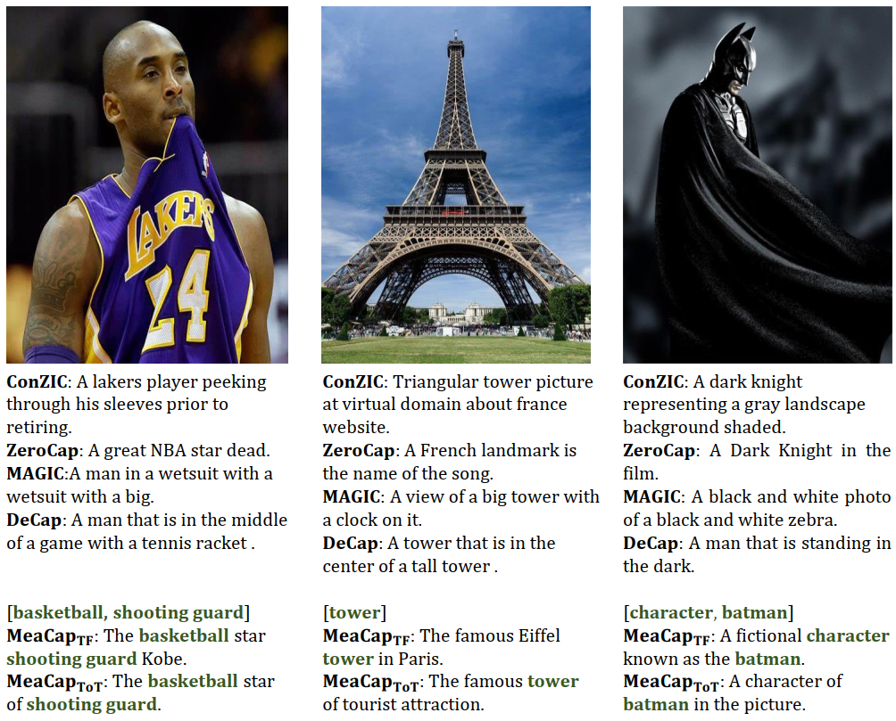

# [CVPR 2024] MeaCap: Memory-Augmented Zero-shot Image Captioning

**Authors**:
[Zequn Zeng](https://joeyz0z.github.io/),
[Yan Xie](),
[Hao Zhang](https://scholar.google.com/citations?user=Eo8e5icAAAAJ),
[Chiyu Chen](),
[Zhengjue Wang](https://scholar.google.com/citations?user=qTQj_I4AAAAJ),
[Bo Chen](https://scholar.google.com/citations?user=uv16_-UAAAAJ)
<br/>
official implementation of MeaCap.

[comment]: <> ([![Project Website]&#40;https://img.shields.io/badge/Project-Website-orange&#41;]&#40;https://tuneavideo.github.io/&#41;)
[](https://arxiv.org/abs/2403.03715)


[comment]: <> (![Local Image]&#40;assets/model.png&#41;)
<div align = center>

</div>

<br/>

<div align = center>

</div>

<br/>


***

## Catalogue:
* <a href='#introduction'>Introduction</a>
* <a href='#citation'>Citation</a>
* <a href='#data'>Data Preparation</a>
    * <a href='#environment'>Environment</a>
    * <a href='#memory'>Memory bank</a>
    * <a href='#model'>Model Zoo</a>
* <a href='#inference'>Inference</a>
    * <a href='#tf'>Training free</a>
    * <a href='#tot'>Text-only training</a> 
    * <a href='#other'>Memory concepts + ViECAP</a>
* <a href='#experiments'>Experiments</a>
* <a href='#acknowledgments'>Acknowledgments</a>

<span id = 'introduction'/>

***

## Introduction
Zero-shot image captioning (IC) without well-paired image-text data can be divided into two categories,
training-free and text-only-training. The main difference between them is whether using a textual corpus to train
the LM. Though achieving attractive performance w.r.t.
some metrics, existing methods often exhibit some common drawbacks. Training-free methods tend to produce
hallucinations, while text-only-training often lose generalization capability. To move forward, in this paper,
we propose a novel Memory-Augmented zero-shot image
Captioning framework (MeaCap). Specifically, equipped
with a textual memory, we introduce a retrieve-then-filter
module to get key concepts that are highly related to the
image. By deploying our proposed memory-augmented
visual-related fusion score in a keywords-to-sentence LM,
MeaCap can generate concept-centered captions that keep
high consistency with the image with fewer hallucinations and more world-knowledge. 

<span id = 'citation'/>


## Citation
If you think MeaCap is useful, please cite this paper!
```
@article{zeng2024meacap,
  title={MeaCap: Memory-Augmented Zero-shot Image Captioning},
  author={Zeng, Zequn and Xie, Yan and Zhang, Hao and Chen, Chiyu and Wang, Zhengjue and Chen, Bo},
  journal={arXiv preprint arXiv:2403.03715},
  year={2024}
}
```
<span id = 'data'/>

***
## Data Preparation 

<span id = 'environment'/>

### Environment
Prepare the python environment:
```
pip install -r requirements.txt
```

<span id = 'memory'/>

### Memory bank
We have preprocessed textual corpus of [CC3M](https://huggingface.co/JoeyZoZ/MeaCap/tree/main/memory), [SS1M](https://huggingface.co/JoeyZoZ/MeaCap/tree/main/memory), [COCO](https://huggingface.co/JoeyZoZ/MeaCap/tree/main/memory), and [Flickr30k](https://huggingface.co/JoeyZoZ/MeaCap/tree/main/memory) and transformed them into CLIP and SentenceBERT embeddings for fast retrieval.
Download our preprocessed memory files and put them into ./data/memory/ , as:
```
data
└── memory
    ├── cc3m
    │   ├── memory_captions.json
    │   ├── memory_clip_embeddings.pt
    │   └── memory_wte_embeddings.pt
    ├── coco
    │   ├── memory_captions.json
    │   ├── memory_clip_embeddings.pt
    │   └── memory_wte_embeddings.pt
    └── ...    
```
you can also preprocess a new textual memory bank, for example:
```
python prepare_embedding.py --memory_id coco --memory_path data/memory/coco/memory_captions.json
```

<span id = 'model'/>

### Model Zoo
MeaCap use multiple pretrained models to finish different purposes. 
The default version of language model is [CBART](https://github.com/NLPCode/CBART).
We provide the download link of pretrained CBART and caption-finetuned CBART.
Please download these weights and put them into ./checkpoints/ .

| Methods                 |Training Datasets| Download link  | Purposes |
|-------------------------|-----------------|----------------|----------------|
|(Needful)|$~~~~$ |$~~~~$ |$~~~~$ |
| CLIP                    |✗                | [link](https://huggingface.co/openai/clip-vit-base-patch32)       | Image-text similarity computation |
| SceneGraphParser        |✗                | [link](https://huggingface.co/lizhuang144/flan-t5-base-VG-factual-sg)       | Parse caption into scene graph|
| SentenceBERT            |✗                | [link](https://huggingface.co/sentence-transformers/all-MiniLM-L6-v2)       | Sentence similarity computation|
|(Optional)|$~~~~$ |$~~~~$ |$~~~~$ |
| CBART-large             |One-billion-word | [link](https://drive.google.com/file/d/13NOAsdSnO-eLIDxdo0M-_sX2KxyrYndX/view?usp=sharing)       | keyword-to-sentence LM for $MeaCap_{TF}$ |
| CBART-large             |CC3M             | [link](https://huggingface.co/JoeyZoZ/MeaCap/tree/main/checkpoints)       | keyword-to-sentence LM for $MeaCap_{ToT}$|
| CBART-large             |SS1M             | [link](https://huggingface.co/JoeyZoZ/MeaCap/tree/main/checkpoints)       | keyword-to-sentence LM for $MeaCap_{ToT}$|
| CBART-large             |COCO             | [link](https://huggingface.co/JoeyZoZ/MeaCap/tree/main/checkpoints)       | keyword-to-sentence LM for $MeaCap_{ToT}$|
| CBART-large             |Flickr30K        | [link](https://huggingface.co/JoeyZoZ/MeaCap/tree/main/checkpoints)       | keyword-to-sentence LM for $MeaCap_{ToT}$|
| ViECAP                  |COCO/Flickr30k   | [link](https://github.com/FeiElysia/ViECap/releases/download/checkpoints/checkpoints.zip)       | baseline of $MeaCap_{InvLM}$|

If you want to finetune CBART on your own caption corpus, please follow the official training instruction from [CBART](https://github.com/NLPCode/CBART?tab=readme-ov-file).

<span id = 'inference'/>

***
## Inference

<span id = 'tf'/>

### Training-free
For training-free version $MeaCap_{TF}$, we use a pretrained CBART. To bridge the gap between pretrained dataset one-billion-word and caption-style texts, we use a default prompt "The image depicts that". We also support prompt ensembling by setting --prompt_ensembling.
```
python inference.py --use_prompt  --memory_id cc3m --img_path ./image_example --lm_model_path ./checkpoints/CBART_one_billion 
```

<span id = 'tot'/>

### Text-only-training
For text-only-training version $MeaCap_{ToT}$, we use finetuned CBART where prompts are needless.
```
python inference.py --memory_id coco --img_path ./image_example --lm_model_path ./checkpoints/CBART_COCO 
```

<span id = 'other '/>

### Memory concepts + ViECAP
We also supporting add memory concepts to strong baseline [ViECAP](https://github.com/FeiElysia/ViECap) in a plug-and-play way, namely $MeaCap_{InvLM}$.
We simply need to replace the entity module by our proposed retrieve-then-filter module in the inference stage and then the performance can be improved. Details are shown in Appendix of our paper.
```
python viecap_inference.py --memory_id coco --image_path "*.jpg" --weight_path "checkpoints/train_coco/coco_prefix-0014.pt"
```

<span id = 'experiments'/>

## Experiments
### Zero-shot captioning
<div align = center>

| Methods     |Training| Memory | MSCOCO | NoCaps val (CIDEr)       |
|-------------|--------|--------|--------|--------------------------|
|             |        |        | CIDEr  | In / Near / Out / Overall   |
| ConZIC      |✗       | ✗      | 5.0    | 15.4 / 16.0 / 20.3 / 17.5      |
| CLIPRe      |✗       | CC3M   | 25.6   | 23.3 / 26.8 / 36.5 / 28.2      |
| $MeaCap_{TF}$ |✗       | CC3M   | 42.5   | 35.3 / 39.0 / 45.1 / 40.2     |
| DeCap       |CC3M    | CC3M   | 42.1   | 34.8 / 37.7 / 49.9 / 39.7      |
| $MeaCap_{ToT}$|CC3M    | CC3M   | 48.3   | 38.5 / 43.6 / **50.0** / 45.1      |
| DeCap       |SS1M    | SS1M   | 50.6   | 41.9 / 41.7 / 46.2 / 42.7      |
| $MeaCap_{TF}$ |✗       | SS1M   | 51.7   | 42.0 / 42.8 / 45.4 / 43.8     |
| $MeaCap_{ToT}$|SS1M    | SS1M   | 54.9   | **44.1** / **46.0** /49.7 / **47.3**      |
</div>

### In/Cross-domain captioning
<div align = center>

Task              | COCO| Flickr30k | COCO $\Rightarrow$ Flickr30k| Flickr30k $\Rightarrow$ COCO |
------------------|-----|-----|-----|-----|
Metric            |CIDEr|CIDEr|CIDEr|CIDEr|
MAGIC             |49.3 |20.4 |17.5 | 18.3|
CLIPRe            |53.4 |31.7 |30.1 | 26.5|
$MeaCap_{TF}$    |56.9 |36.5 |34.4 | 46.4|
$MeaCap_{ToT}$    |84.8 |50.2 |40.3 | 51.7|
$~~~~$|$~~~~$|$~~~~$|$~~~~$|$~~~~$|
DeCap             |91.2 |56.7 |35.7 | 44.4|
CapDec            |91.8 |39.1 |35.7 | 27.3|
ViECap            |92.9 |47.9 |38.4 | 54.2|
$MeaCap_{InvLM}$ |**95.4** |**59.4** |**43.9** | **56.4**|

<span id = 'acknowledgments'/>

## Acknowledgements

This code is heavily depend on [ConZIC](https://github.com/joeyz0z/ConZIC), [CBART](https://github.com/NLPCode/CBART) and [ViECAP](https://github.com/FeiElysia/ViECap).

Thanks for their good work.

