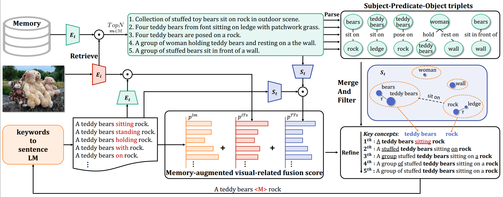

# Official implementation for MeaCap
**[CVPR 2024][MeaCap: Memory-Augmented Zero-shot Image Captioning](https://arxiv.org/abs/2403.03715)**
<br/>
[Zequn Zeng](https://joeyz0z.github.io/),
[Yan Xie](),
[Hao Zhang](https://scholar.google.com/citations?user=Eo8e5icAAAAJ),
[Chiyu Chen](),
[Zhengjue Wang](https://scholar.google.com/citations?user=qTQj_I4AAAAJ),
[Bo Chen](https://scholar.google.com/citations?user=uv16_-UAAAAJ)
<br/>

[comment]: <> ([![Project Website]&#40;https://img.shields.io/badge/Project-Website-orange&#41;]&#40;https://tuneavideo.github.io/&#41;)
[](https://arxiv.org/abs/2403.03715)
***



## Demo
Download memory files to ./data/: [Memory](https://drive.google.com/file/d/1iN886emz_9Sa31gLyL5LbdCFE98rLU4-/view?usp=drive_link)

Download Model weight to ./checkpoints/: [Model](https://drive.google.com/file/d/1qEAi7yFqaiZ-Ufa3GeoHEA9e4A8LrNN0/view?usp=drive_link)

Prepare environment:
```
pip install -r requirements.txt
```
Inference demo:
```
cd models
python main.py --img_path ../demo --model_path path/to/model
```

## Cite as
```
@article{zeng2024meacap,
  title={MeaCap: Memory-Augmented Zero-shot Image Captioning},
  author={Zeng, Zequn and Xie, Yan and Zhang, Hao and Chen, Chiyu and Wang, Zhengjue and Chen, Bo},
  journal={arXiv preprint arXiv:2403.03715},
  year={2024}
}
```

## Acknowledgement

This code is heavily depend on [ConZIC](https://github.com/joeyz0z/ConZIC) and [CBART](https://github.com/NLPCode/CBART).

Thanks for their good work.

